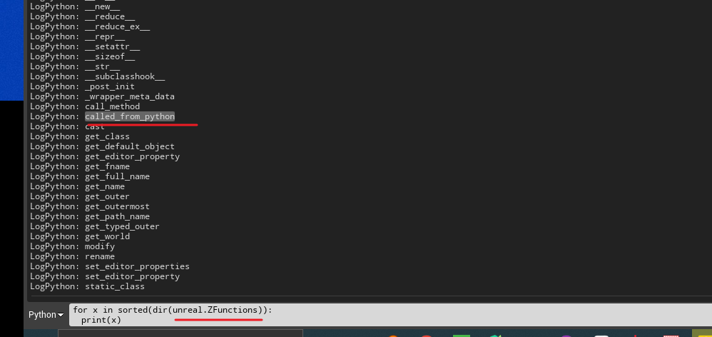

里面的示例代码主要是  参考了   阿棍 录制的一套教程     Python in UE4 [完]

### UE 调用c++该函数的方法：


> 参考 教程  Python in UE4 [完] P7 调用C++ 

1、 先创建一个c++ 类，继承自 蓝图类   命名为 ZFunctions


```C++
//ZFunctions.h 代码
 
// Fill out your copyright notice in the Description page of Project Settings.

#pragma once

#include "CoreMinimal.h"
#include "Kismet/BlueprintFunctionLibrary.h"
#include "ZFunctions.generated.h"

/**
 * 
 */
UCLASS()
class AGUNPYTHONPRACTICE_API UZFunctions : public UBlueprintFunctionLibrary
{
	GENERATED_BODY()

public:
	UFUNCTION(BlueprintCallable)
	static void CalledFromPython(FString InputString);
	
};


//ZFunctions.cpp 代码
    
// Fill out your copyright notice in the Description page of Project Settings.


#include "ZFunctions.h"

void UZFunctions::CalledFromPython(FString InputString)
{
	UE_LOG(LogTemp, Error, TEXT("%S"), *InputString);
}

// 在python控制台里面打印unreal里面的类，就可以看到这个函数

for x in sorted(dir(unreal)):
	print(x)

out： 
```




### UE 蓝图 调用c++该函数的方法：

> 参考 Python in UE4 [完] P8 改变目录颜色

1、首先是在c++里面去定义这些文件，把文件定义好


2、新建一个蓝图，继承自Actor，在蓝图里面去添加一个自定义事件，自定义事件里面需要把Call In Editor 给勾上


3、在蓝图里面调用函数，给一个路径，设置颜色

4、把蓝图拖到编辑器里面，然后点击右边的按钮


5、测试功能，就可以修改sounds文件夹的颜色为黄色，但是这个是需要重启才能看到效果，新建一个文件夹，可以把

文件夹变成红色


6、在python里面调用此函数，然后创建文件夹，设置颜色


### UE 蓝图 调用c++该函数的方法(修改编译文件)：

> Python in UE4 [完] P9 打开和关闭资源编辑器.mp4


# 常见的c++解决错误的办法

### 1、c++ 函数里面需要参数

```c++
LogPython: Error:     return unreal.CppLib.get_selected_assets()
LogPython: Error: TypeError: descriptor 'get_selected_assets' of 'CppLib' object needs an argument
    
# 后台有一个cpp函数，但是unreal里面调用出错了，解决的办法是c++函数里面加上static

// 获取选中的资源
UFUNCTION(BlueprintCallable, Category = "Unreal Python")
static TArray<FString> GetSelectedAssets();
    
```

### 2、不允许使用不完整的类类型  


解决的办法是缺少头文件，把这个类协商，定位到类所在的文件，引入头文件

```C++
#include "IContentBrowserSingleton.h"
```

### 3、无法解析的外部命令


