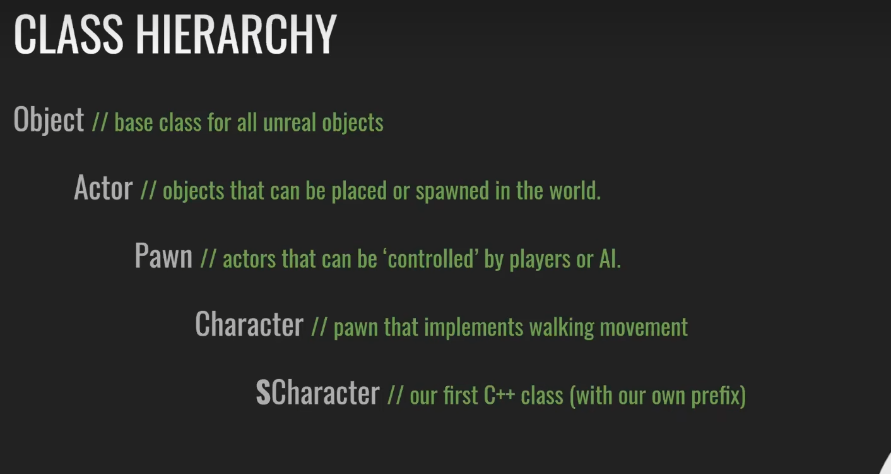
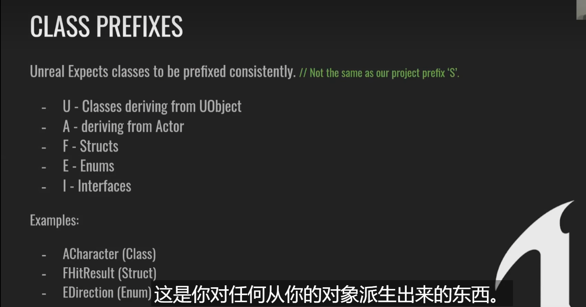
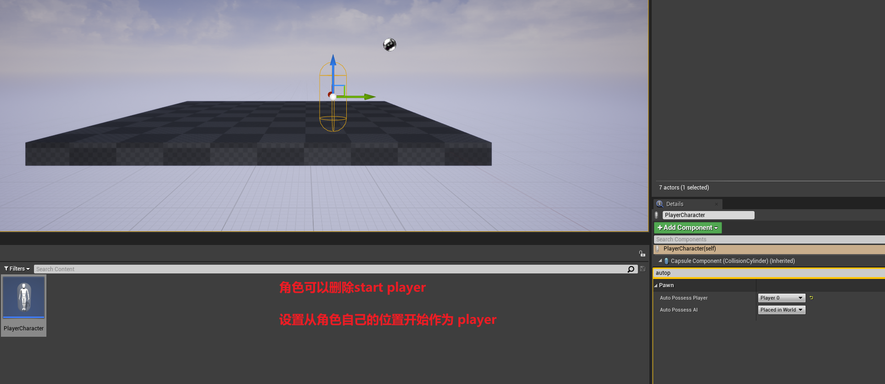
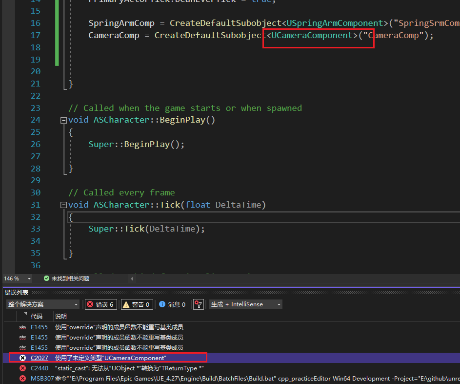
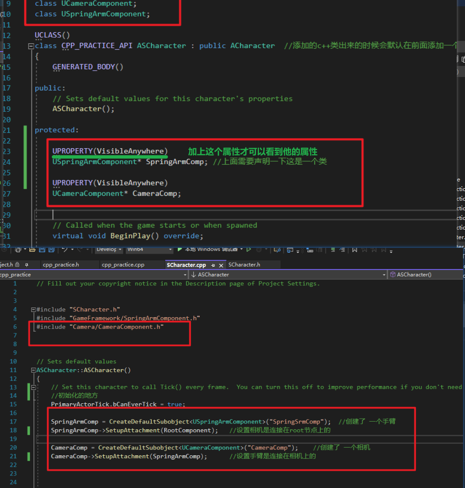

# unreal_code_practice

学习 https://www.bilibili.com/video/BV1nU4y1X7iQ?p=3&vd_source=06877159de8243020a4485caaa2ed800

哔哩哔哩上的一套教程，名字是《【教程】斯坦福专用课程 UE4 & C++ 专业游戏开发教程 24.5小时 》

P3：

我们自己在unreal里面建一个类，继承自 Character  名字是  SCharacter; 但是cpp代码里面的名字却是  ASCharacter

这是代表类的名字是从Actor派生的。标识是一个类

下面这张图详细的说明了类型前缀的含义


### UE4类的层级结构



## 类的前缀代表的含义



## 设置玩家开始的位置



## C++类快速声明的方法

经常在c++里面会遇到这个问题，但却不知道头文件该怎么去引用这个类，看教程知道了

直接点击UcameraComponent这个类，然后复制路径：E:\Program Files\Epic Games\UE_4.27\Engine\Source\Runtime\Engine\Classes\GameFramework\SpringArmComponent.h

只需要留下 GameFramework/SpringArmComponent.h  这个位置即可。添加到头文件里面

```C++
#include "Components/SceneComponent.h"
```



## 

## 给蓝图添加组件的方法


